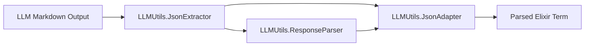

# llm_utils — Development Guide

## Architecture

`llm_utils` is a pure data-processing library with three layers:



### Layer 1: JsonExtractor

Extracts JSON strings from LLM markdown output. Handles:

- ```json blocks (code-fenced JSON)
- ``` blocks (generic code-fenced)
- Raw JSON strings (unwrapped)
- Mixed content (markdown + JSON fragments)

### Layer 2: JsonAdapter

Defensive JSON decode. Entry point for all JSON parsing:

- `decode/1` — returns `{:ok, term}` or `{:error, reason}`
- `decode!/1` — returns term or raises `RuntimeError`
- Falls back to `json_remedy` if `Jason` fails
- Guard clauses on nil, non-binary, empty string

### Layer 3: ResponseParser

Composes Extractor + Adapter for end-to-end parsing:

- `parse/1` — extracts JSON, decodes, returns `{:ok, term}` or `{:error, reason}`
- `parse!/1` — returns term or raises `RuntimeError`
- `parse_json_array/1` — for array-wrapped responses
- `has_json_block?/1` — predicate for JSON content detection

## Design Principles

1. **No process dependencies** — no GenServers, no side effects, no ETS
2. **No mocks in tests** — test against real data, not mocked modules
3. **Guard clauses at every entry point** — nil, non-binary, empty string
4. **Error messages include module name** — `"LLMUtils.JsonAdapter failed: ..."`
5. **Minimum dependencies** — Jason + json_remedy only. Keep it light.

### Testing

- Location: `test/llm_utils/`
- Run: `mix test` from `lib/anantha_json/`
- 26 tests covering: markdown-wrapped JSON, malformed JSON, empty input, edge cases
- Key patterns: test extraction from ```json blocks, test decode with trailing commas, test response parser with multi-object responses
