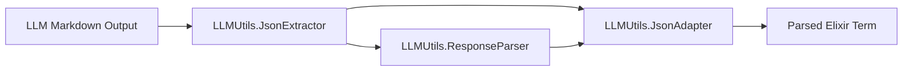

# llm_utils — Development Guide

## Architecture

`llm_utils` is organized in three layers:

### Layer 1: JSON Processing (pure, stateless)



#### JsonExtractor
Extracts JSON strings from LLM markdown output. Handles:
- ```json blocks (code-fenced JSON)
- ``` blocks (generic code-fenced)
- Raw JSON strings (unwrapped)
- Mixed content (markdown + JSON fragments)

#### JsonAdapter
Defensive JSON decode. Entry point for all JSON parsing:
- `decode/1` — returns `{:ok, term}` or `{:error, reason}`
- `decode!/1` — returns term or raises `RuntimeError`
- Falls back to `json_remedy` if `Jason` fails
- Guard clauses on nil, non-binary, empty string

#### ResponseParser
Composes Extractor + Adapter for end-to-end parsing:
- `parse/1` — extracts JSON, decodes, returns `{:ok, term}` or `{:error, reason}`
- `parse!/1` — returns term or raises `RuntimeError`
- `parse_json_array/1` — for array-wrapped responses
- `has_json_block?/1` — predicate for JSON content detection

### Layer 2: Provider Infrastructure (stateless)

```
LLMUtils.Provider (behaviour)
  └─ config/0 callback → provider metadata
  └─ auth_headers/2 → auth headers
  └─ env_key/1 → env var name
  └─ get_api_key/1 → API key resolution

LLMUtils.Providers (registry)
  └─ all/0 → list all provider configs
  └─ get/1 → single provider by ID
  └─ exists?/1 → provider check
```

Provider modules implement the `Provider` behaviour. Each defines:
- Auth type (bearer token, subscription key, none)
- JSON mode support
- Rate limit (requests per minute)
- Support for system role vs user role mapping
- Thinking tag suppression requirements
- API key environment variable name

Supported providers: `openai`, `nim` (NVIDIA), `groq`, `grok` (xAI), `sarvam`, `fireworks`, `mimo` (Xiaomi), `minimax`, `mock`.

### Layer 3: Stateful Infrastructure (ETS-based, overridable)

```
LLMUtils.Client
  ├── chat_completion/3 → HTTP call with full pipeline
  ├── RateLimiter — ETS sliding window
  ├── CircuitBreaker — ETS 3-state
  ├── Metrics — ETS counters
  └── Logging — toggleable logger
```

All stateful features use public ETS tables with module-level callbacks.
Consumer apps can inject custom implementations via opts.

#### Client
Core HTTP client. `chat_completion/3` performs:
1. Rate limit check → `{:error, :rate_limited}` if exceeded
2. Circuit breaker check → `{:error, :circuit_open}` if open
3. API key resolution → `{:error, :missing_api_key}` if missing
4. Build request body with provider-specific formatting
5. Send HTTP request via Req
6. Normalize response (strip thinking tags, convert system→user, extract reasoning content, parse tool calls)
7. Record metrics (request count, success/failure, latency)
8. Return normalized `{:ok, map}` or `{:error, term}`

#### RateLimiter
ETS-based sliding window. `check/3` takes provider ID, max requests, window duration.
Auto-creates ETS table on first use.

#### CircuitBreaker
ETS-based 3-state. Call `call/3` with a function — auto-transitions on success/failure.
Auto-transitions open→half_open after configurable reset timeout.
Auto-transitions half_open→closed on success, half_open→open on failure.

#### Metrics
ETS-based counters. `record/1` stores call metrics, `get_stats/1` returns aggregated snapshot.
`reset/0` clears all counters.

#### Logging
Toggleable structured logger. `enable/0`, `disable/0`, `enabled?/0` control state.
Logs structured metadata with provider, model, duration fields.

## Design Principles

1. **No process dependencies** — ETS tables with module callbacks, no GenServers
2. **Overridable state** — all stateful modules accept opts for custom implementations
3. **Guard clauses at every entry point** — nil, non-binary, empty string, unknown provider
4. **Error messages include module name** — `"LLMUtils.JsonAdapter failed: ..."`
5. **Minimum dependencies** — Jason, json_remedy, Req. Keep it light.

## Testing

- Location: `test/llm_utils/`
- Run: `mix test` from `lib/anantha_json/`
- 46 tests covering: JSON extraction, JSON decode, response parsing, rate limiting,
  circuit breaking, metrics, logging, and edge cases
- Stateful module tests run with `async: false` (ETS tables shared across tests)
- Pure function tests run with `async: true` (JsonExtractor, JsonAdapter)

## Stateful Module Overrides

Consumer apps can override any stateful module by passing opts:

```elixir
LLMUtils.Client.chat_completion(:openai, messages,
  rate_limiter: MyApp.RateLimiter,
  circuit_breaker: MyApp.CircuitBreaker,
  metrics: MyApp.Metrics,
  logging: MyApp.Logging
)
```

Each module defaults to ETS-backed implementations when not overridden.